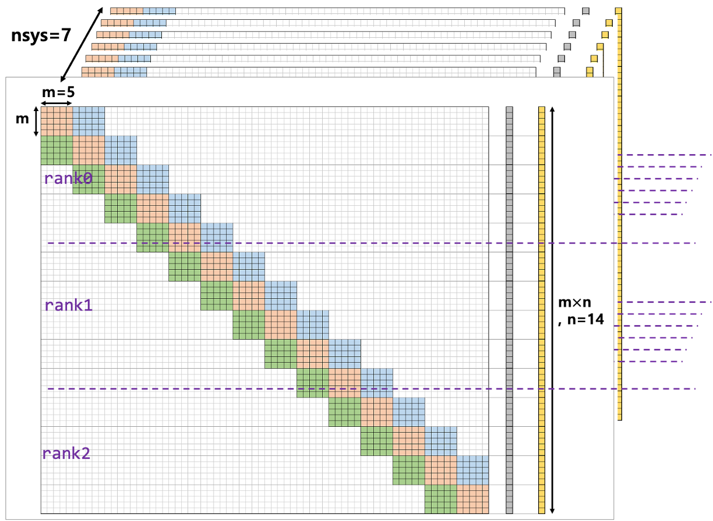

** 예시문제 설명

- 5by5 block tridagonal system: m=5
- system 7개: nsys=7
- block 14개: n=14
- solution: {1, 1, ... ,1}
- 사용 core수: 3.
- 각 코어당 block 개수: nsub=5(rank0),5(rank1),4(rank1)


** (1) 빌드방법-실행방법-정리
```bash
source 1_build.sh
source 2_run.sh
source 3_clean.sh
```
빌드 주의 사항
- `1_build.sh`에서 LAPACKE와 cblas 경로를 지정해 줘야함
